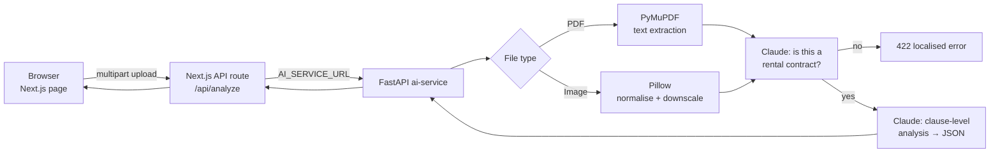

# MietChecker

AI review of German rental contracts for tenants — upload a *Mietvertrag* as a PDF
or a phone photo and get the risky clauses quoted back, with the relevant § BGB
reference and what to do about each one, in English, German or Ukrainian.

## The problem

Rental contracts in Germany regularly contain clauses that are unenforceable —
blanket renovation duties, oversized deposits, uncapped small-repair costs — but
tenants, especially newcomers who don't read legal German, sign them anyway
because checking a contract means paying a lawyer or joining a *Mieterverein*
first.

## What it does

- **Accepts real-world input** — text PDFs and photos or scans (JPG, PNG, WEBP).
- **Rejects the wrong document early** — anything that is not a rental contract
  gets a clear message instead of a made-up analysis.
- **Quotes, doesn't paraphrase** — each finding contains the exact clause, why
  it is a problem, the legal reference and practical advice, split into
  *critical* and *moderate* risks plus a list of compliant clauses.
- **Checks the usual suspects explicitly** — deposit (§ 551), cosmetic repairs
  and colour requirements (BGH case law), access rights (§ 535), notice periods
  (§ 573c), rent increases (§ 558), service charges (§ 556), small-repair clause
  caps and modernisation surcharges (§ 559).
- **Three languages** — interface, analysis and error messages in EN / DE / UK.

## Architecture



The frontend never talks to the AI service directly: a Next.js route handler
proxies the upload, so the Python service and the Anthropic key stay server-side
and the service URL is configured in one environment variable.

## Engineering notes

- **Validation gate before analysis.** A first Claude call answers only YES/NO
  (10 output tokens) on whether the document is a rental contract. Holiday
  photos and invoices are rejected cheaply instead of producing a confident
  but meaningless legal report.
- **Two input paths, one prompt.** Text PDFs go through PyMuPDF; scans and
  photos are sent to Claude's vision input. A PDF with almost no extractable
  text (under 50 characters — a scanned PDF) fails with a clear message rather
  than being analysed as empty.
- **Image normalisation.** Images above 4 MB are downscaled to 2048 px JPEG, and
  PNGs with transparency or palettes are converted to RGB JPEG, so the vision
  API always receives a size and media type it accepts.
- **Structured output.** The model must return a fixed JSON shape
  (`critical_risks`, `moderate_risks`, `all_good`, `conclusion`), with
  defensive stripping of Markdown fences before parsing, so the UI renders
  findings as cards instead of free text.

## Running locally

Requirements: Python 3, Node.js 20+, an Anthropic API key.

```bash
git clone https://github.com/Maksym37526/mietchecker.git && cd mietchecker

# AI service
cd ai-service
cp .env.example .env          # add ANTHROPIC_API_KEY
pip install -r requirements.txt
python main.py                # http://localhost:8000

# Frontend (second terminal)
cd frontend
cp .env.example .env.local    # AI_SERVICE_URL=http://localhost:8000
npm install
npm run dev                   # http://localhost:3000
```

## Try it

📄 [`docs/sample-mietvertrag.pdf`](docs/sample-mietvertrag.pdf) — a fictional
two-page contract (all names, addresses and amounts invented) written to contain
typical invalid clauses, so you can test the analysis without uploading a real
contract:

| Clause | Why it should be flagged |
|---|---|
| § 4 — automatic 10 % rent increase every year | Rent increases only via agreed stepped/index rent or § 558 procedure |
| § 5 — deposit of four months' net rent, in one cash payment | § 551: max. three months, payable in three instalments |
| § 6 (1) — fixed renovation intervals regardless of condition | Rigid *Schönheitsreparaturen* schedules are invalid (BGH) |
| § 6 (2) — white walls only, full white repaint on move-out | Colour requirements during tenancy and regardless of last renovation (BGH) |
| § 7 — small repairs up to €250 per case, no annual cap | Per-case cap too high and no yearly limit |
| § 8 — landlord may enter at any time without notice | Access only for a legitimate reason and with advance notice |
| § 9 — blanket ban on all pets | A general ban including small animals is invalid (BGH) |
| § 10 (1) — six-month notice period for the tenant | § 573c: tenant's notice period cannot be extended |

§§ 1–3, 11 and 12 are ordinary clauses and should not be flagged.

## What I'd do differently

- **Validate the model output with the Pydantic schema** that already exists in
  `models/schemas.py`, and retry on invalid JSON instead of returning a 500.
- **Use the async Anthropic client** — the endpoints are `async`, but the SDK
  calls are synchronous and block the event loop during analysis.
- **Handle long contracts explicitly.** PDF text is cut at 15,000 characters;
  the end of a long contract should be chunked or at least flagged, not silently
  dropped.
- **Tighten CORS** from `*` to the frontend origin, and add a Docker Compose
  setup so the two services start with one command.
- **Build a test set of annotated contracts** with known illegal clauses to
  measure how many the analysis actually catches.

## Stack

Next.js · React · TypeScript · Tailwind CSS · Python · FastAPI · PyMuPDF · Pillow ·
Pydantic · Anthropic Claude (text + vision)

## Status

MVP. It ran publicly on Railway; hosting is currently paused, so there is no live
demo right now. The code runs locally as described above.

> Not legal advice — results are informational and do not replace a lawyer or a
> tenants' association.
